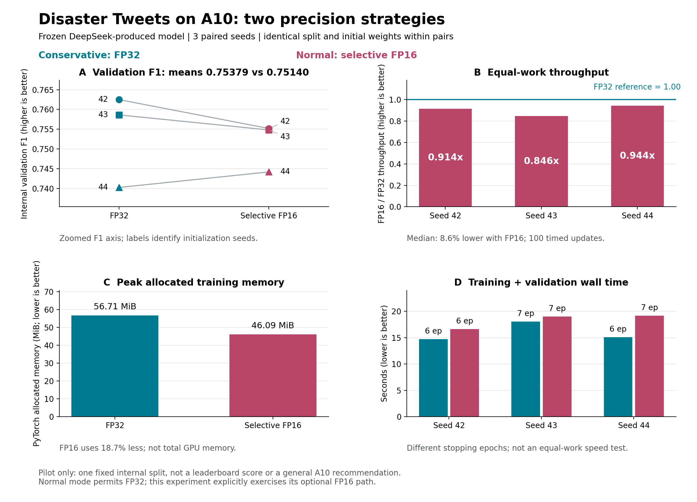
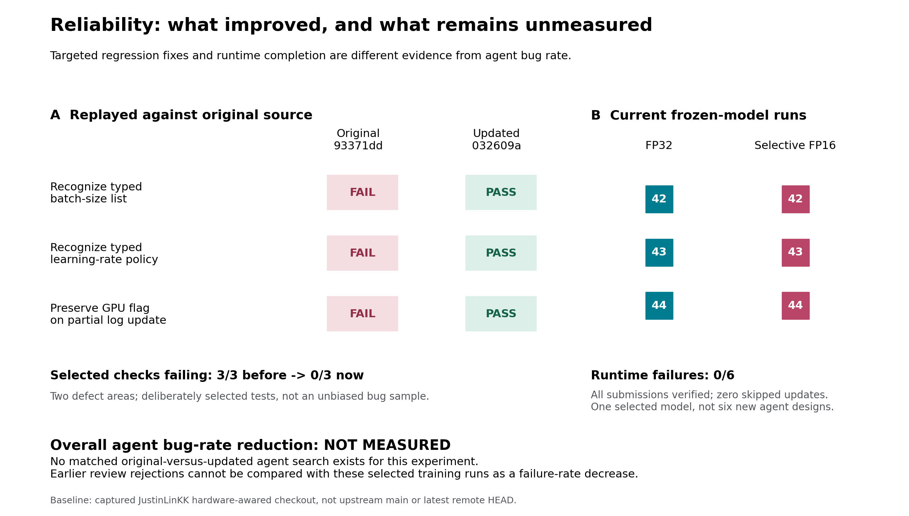

# Disaster Tweets: Precision and Reliability

## Precision Comparison



Three paired seeds of the same frozen DeepSeek-produced model on A10 gave mean
internal validation F1 of 0.75379 for strict FP32 and 0.75140 for selective FP16.
FP16 had 8.6% lower median equal-work throughput and 18.7% lower peak allocated
training memory. One FP16 run trained an extra epoch, so total wall time is not
an equal-work speed comparison. Both paths completed successfully with no skips.
Normal mode still permits FP32; its optional FP16 path was forced only for this
controlled precision experiment. These are not independent agent searches.

## Reliability Evidence



Replayed identical regression inputs against the captured original JustinLinKK
`hardware-awared` checkout, `93371dd64b8e2b888c1bde7cb9d90d7c03ac4e5d`, and updated
`032609a207e086e73b6d6e1a7354973ab153dc65`. No checkout was changed. All three
selected checks failed before and passed after: recognizing typed batch lists,
recognizing typed learning-rate policies, and preserving the GPU flag during
partial job-log updates. The first two share one parser defect area; this is not
three independent root causes or a random sample of agent behavior.

**The update is demonstrably better for these concrete defects. Overall agent
bug-rate reduction, time to first accepted node, and predictive performance
versus the unmodified checkout remain unmeasured under matched conditions.**
Zero failures in six selected-model runs is not proof of zero agent bugs.
Earlier review rejections, adapter failures, and the repaired milestone used
different procedures and cannot supply a comparable before/after rate.

Older PetFinder upstream comparisons retained in this repository use a different
dataset, agent, revisions and search settings. They are not evidence for the
effect of these new HWDB and precision changes.

The next decisive comparison is original versus updated agent search using the
same A10, DeepSeek profile, data split, both precision modes, and matched candidate
budgets. Log every generated candidate, including review and preflight rejections;
report genuine code defects, validator false positives, infrastructure failures,
accepted-execution failures and time to first valid node separately. Use the same
independent audit for both versions. Do not count successful optimizer updates as
independent agent samples or exclude rejected candidates from the denominator.

## Reproduce

```bash
.venv/bin/python deployments/plot_disaster_precision_results.py
```

Inputs: `records/2026-09-12_disaster_precision_results.json` and the two pinned git
revisions above. The exact regression observations are in
`targeted-regression-comparison.json`. Figures are provided as PNG and vector PDF.
